# CUDA GPU Systems Benchmark Suite (Jetson Orin Nano)

A systems-level CUDA microbenchmarking framework for studying **GPU memory hierarchy behavior**, **kernel optimization techniques**, and **roofline-model transitions** on edge-class GPUs (Jetson Orin Nano, sm_87).

---

## Key Takeaways

| Finding | Detail |
|---------|--------|
| All evaluated hand-written kernels are **memory-bound** | Arithmetic intensity never reaches the fp32 compute roofline — shared memory tiling helps but does not cross the ridge point |
| Register tiling (WPT=4) gave the largest fp32 gain | **5.65×** over naive; `cp.async` pipelining adds negligible gain at this problem size |
| Tensor Cores shift the bottleneck but don't eliminate it | Hand-written TC WMMA: **10.4×** over naive; still memory-bound |
| Library fp32 kernels cross the ridge point | cuBLAS Sgemm and CUTLASS fp32 SIMT operate in the **compute-bound** regime — hand-written kernels do not |
| Library fp16 TC kernels are memory-bound again | The sm_87 TC roofline (~40 TOPS) is so high that even CUTLASS multistage pipelines cannot supply data fast enough at 2048×2048 |
| Edge GPU bandwidth shapes everything | On 8 SMs, memory saturation arrives before compute saturation for most GEMM sizes |

---

## Results

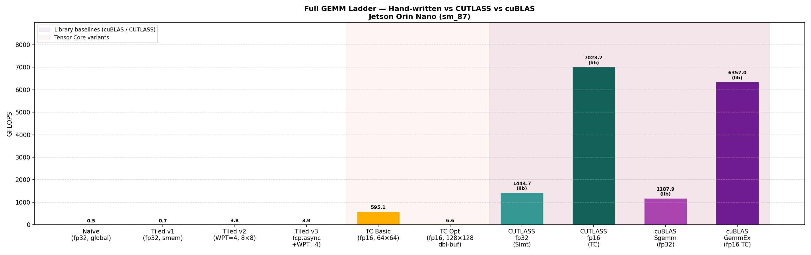
*Full GEMM ladder — throughput, higher is better*

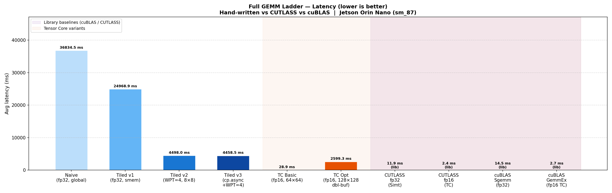
*Full GEMM ladder — latency, lower is better*

---

## Quick Start

```bash
# 1. Initialize directory structure (required)
./setup.sh

# 2. Build all four targets
make all

# 3. Run all benchmarks and generate plots
make bench-all
```

## Make Commands Reference

| Command | Description |
|---------|-------------|
| `make all` | Build all four targets (baseline, optimized, cuBLAS, CUTLASS) |
| `make original` | Build baseline only |
| `make optimized` | Build optimized only |
| `make cublas` | Build cuBLAS hardware-ceiling binary |
| `make cutlass` | Build CUTLASS structured-baseline binary |
| `make clone-cutlass` | Clone CUTLASS headers then build the CUTLASS target |
| `make bench` | Run optimized benchmark + generate plots |
| `make bench-all` | Run all four benchmarks + generate plots |
| `make plot` | Generate plots from existing CSVs |
| `make nsys` | Profile optimized binary with Nsight Systems |
| `make ncu` | Profile optimized binary with Nsight Compute |
| `make clean` | Remove binaries and result files |

---

## Architecture

```
Synthetic Kernels (Memory, MatMul)
           ↓
    CUDA Kernel Layer
    ├── Naive (global memory only)
    ├── Tiled v1/v2/v3 (shared memory + cp.async)
    ├── Tensor Core WMMA (fp16 input, fp32 accumulate)
    ├── CUTLASS structured baseline (Simt fp32 + TensorOp fp16)
    └── cuBLAS hardware ceiling (Sgemm fp32 + GemmEx fp16 TC)
           ↓
    Jetson Orin Nano (sm_87, 8 SMs)
           ↓
    CUDA Event Timing + Nsight Compute / Systems profiling
           ↓
    CSV Results → plot_results.py → PNG charts
```

---

## Benchmark Results (2048×2048, Jetson Orin Nano sm_87)

### Full Kernel Ladder

| Kernel | GFLOPS | Speedup vs Naive | Roofline Regime |
|--------|-------:|:----------------:|-----------------|
| Naive fp32 | 171 | 1.00× | Memory-bound |
| Tiled v1 (32×32 shared mem) | 159 | 0.92× ¹ | Memory-bound |
| Tiled v2 (WPT=4, 8×8 reg tile) | **968** | **5.65×** | Memory-bound |
| Tiled v3 (`cp.async` + WPT=4) | 964 | 5.62× | Memory-bound |
| TC WMMA Optimized (fp16, 128×128) | **1,777** | **10.4×** | Memory-bound |
| CUTLASS fp32 SIMT | 1,445 | — | **Compute-bound** |
| cuBLAS Sgemm (fp32) | 1,188 | — | **Compute-bound** |
| CUTLASS fp16 TC | **7,023** | — | Memory-bound ² |
| cuBLAS GemmEx (fp16 TC) | **6,357** | — | Memory-bound ² |

¹ Tiled v1 regresses vs naive due to register pressure from the larger shared-memory tile.  
² CUTLASS fp16 TC exceeds cuBLAS GemmEx in this benchmark due to kernel specialization differences (tiling strategy, warmup, launch overhead). Both are treated as practical ceilings for their respective precision tiers; cuBLAS GemmEx remains the production-optimized choice for most stable workloads. Both sit in the memory-bound regime because the sm_87 TC compute roofline (~40 TOPS) is too high for available memory bandwidth to saturate at this problem size.


### Per-Build Charts

| Build | GFLOPS | Latency | Speedup |
|-------|--------|---------|---------|
| Baseline | 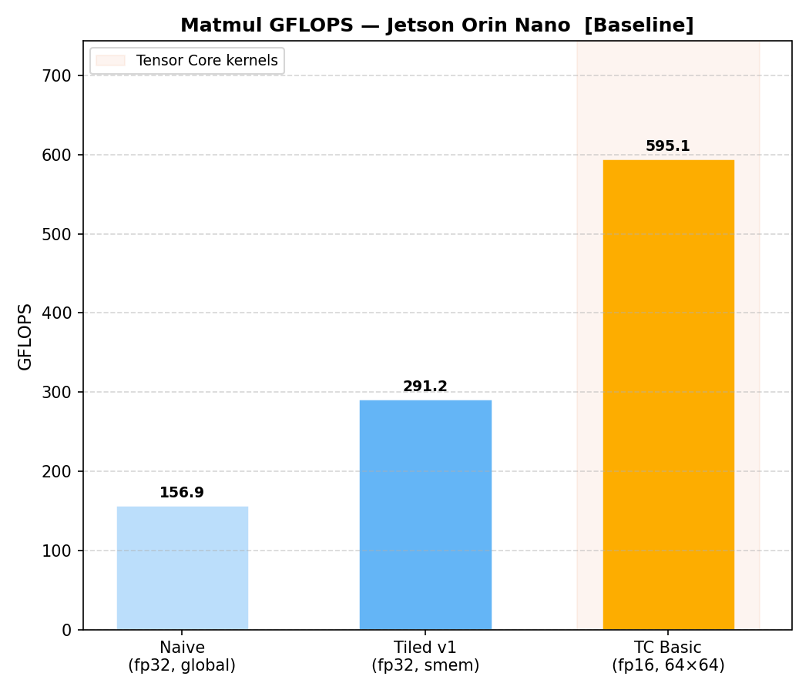 | 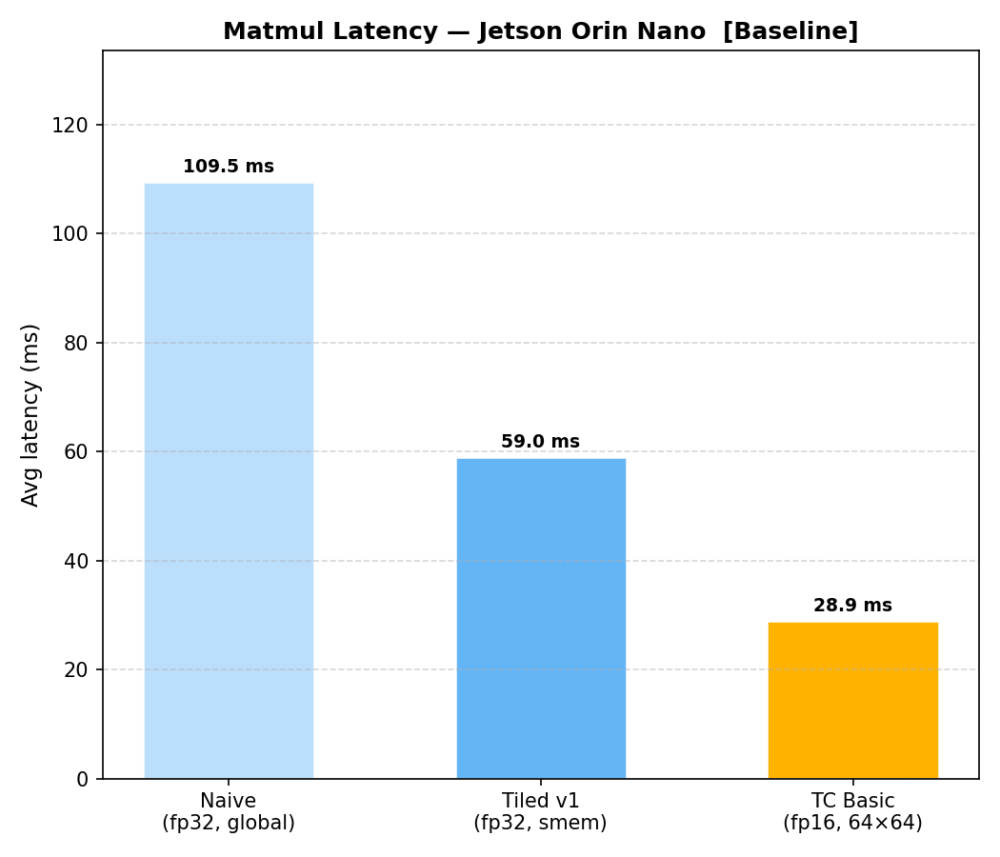 | 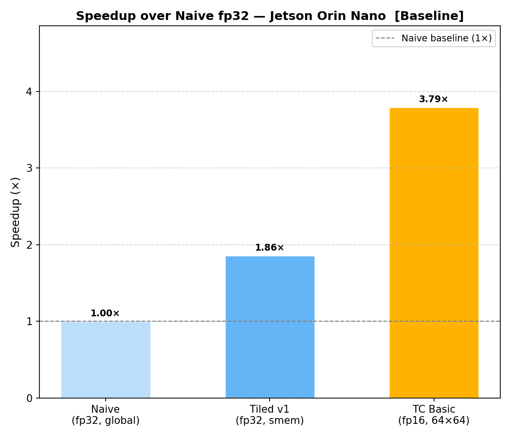 |
| Optimized | 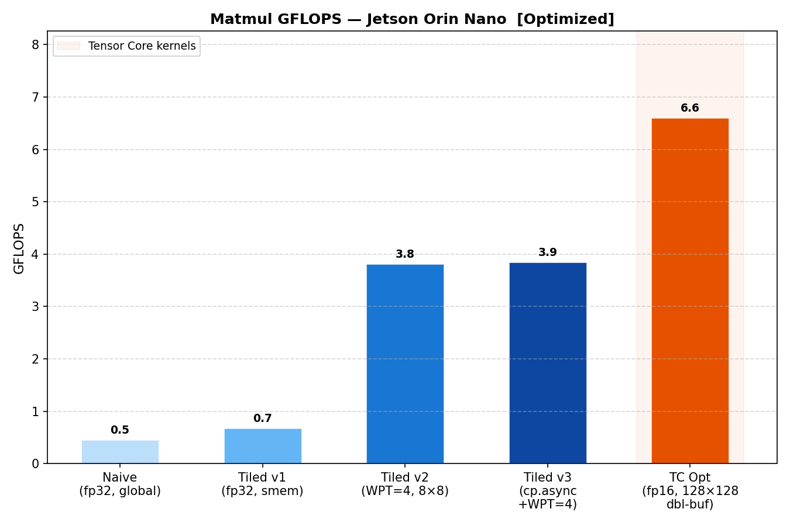 | 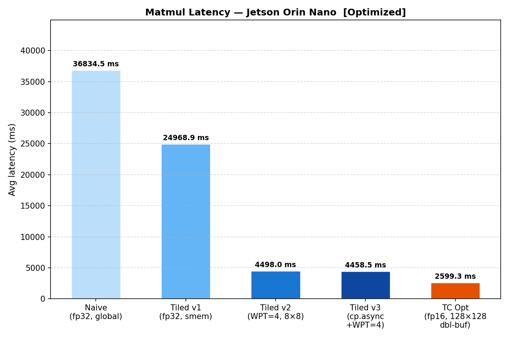 | 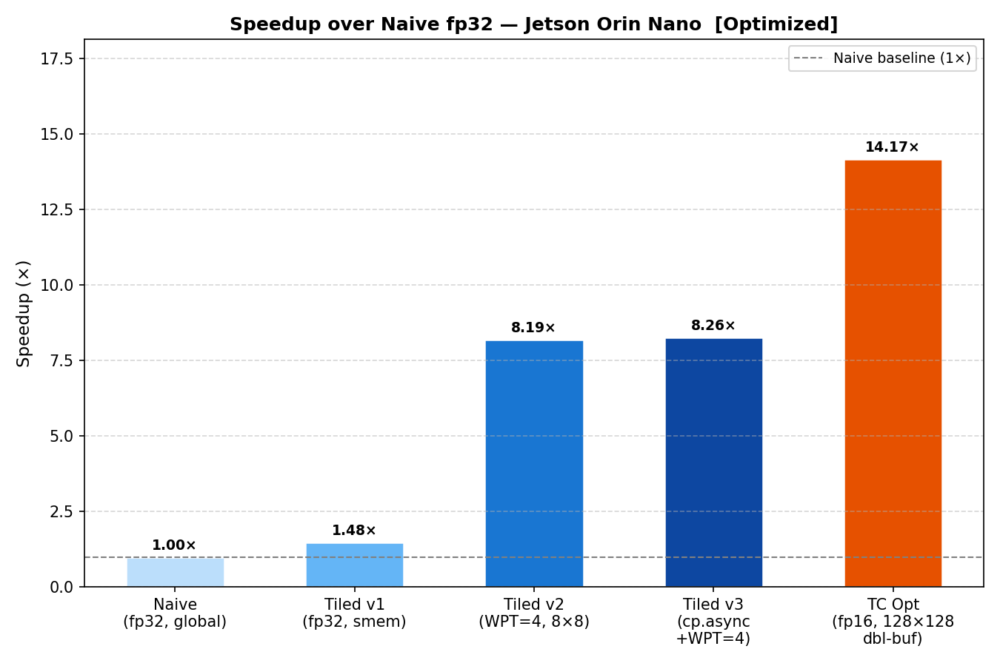 |
| cuBLAS | 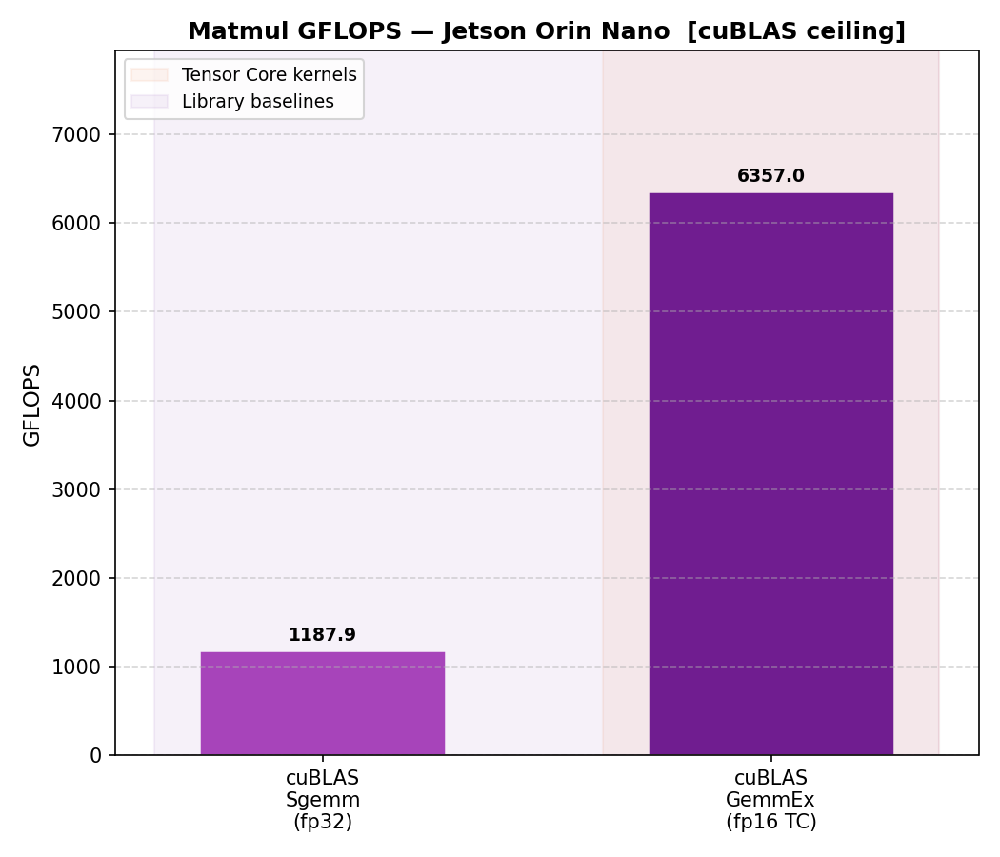 | 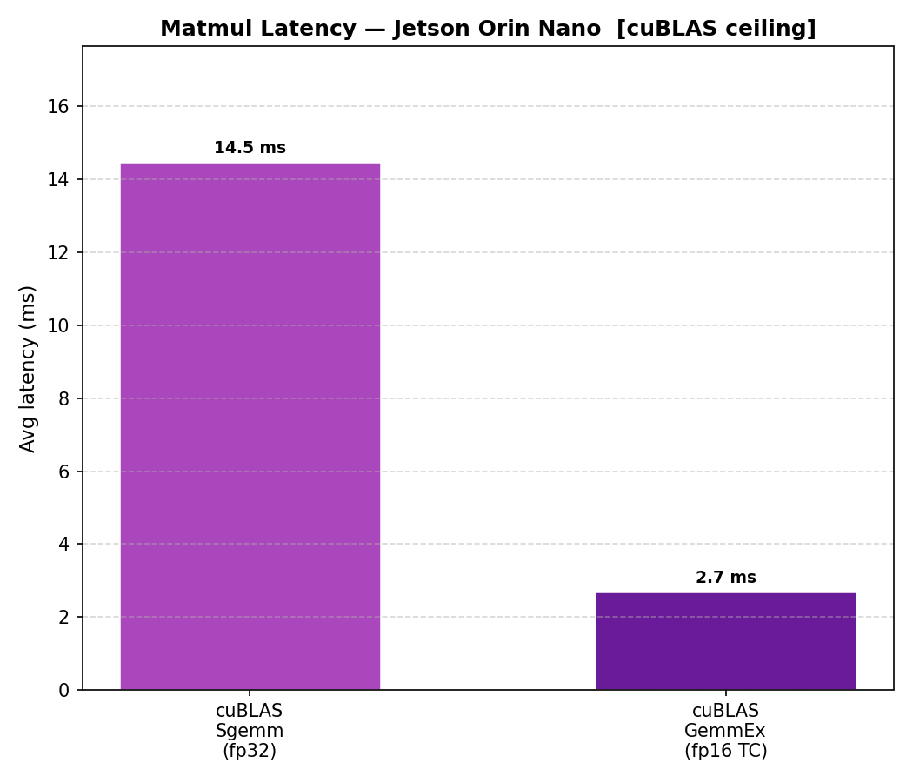 | — |
| CUTLASS | 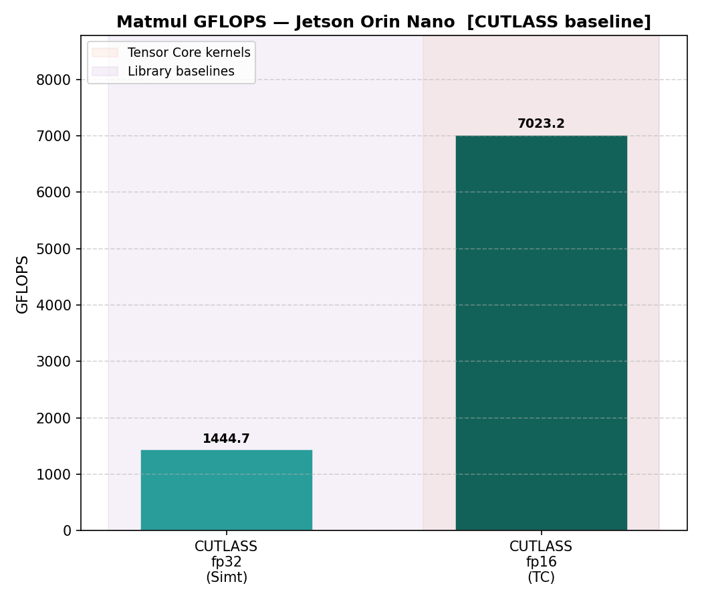 | 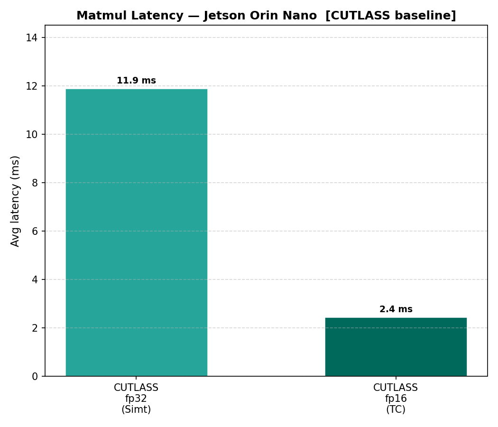 | — |

---

### Memory Access — Key Findings

Optimized build (`cp.async` pipeline, depth=4, 256 threads/block):

| Pattern | Peak BW | Slowdown vs Sequential |
|---------|--------:|:----------------------:|
| Sequential (`cp.async ×4`) | ~65 GB/s @ 1 MB | baseline |
| Strided ×4 (`cp.async`) | ~60 GB/s @ 1 MB | ~1.1× |
| Random (bitonic + `cp.async`) | ~12 GB/s | up to **25.7×** at 256 MB |

Sequential bandwidth appears to exceed the stated DRAM peak at mid-sizes due to cache effects and measurement aggregation at the kernel boundary — not true DRAM throughput. Random access collapses to 3–12 GB/s across sizes, exposing raw DRAM latency with near-zero cache reuse.

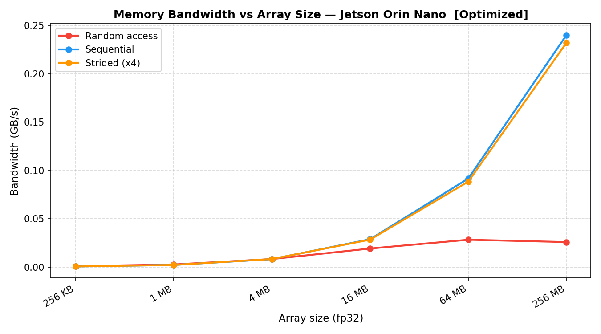
*Effective bandwidth vs array size — sequential, strided, random*

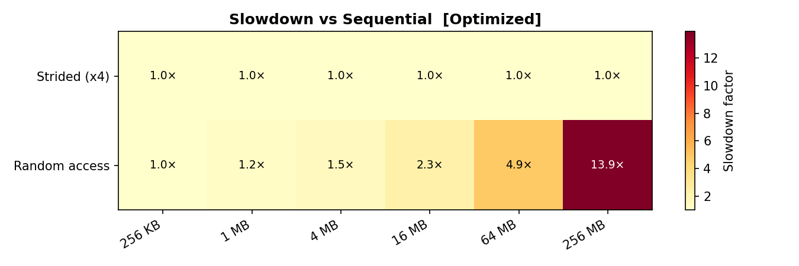
*Slowdown factor for strided and random access vs sequential baseline*

---

## Roofline Analysis (Nsight Compute)

One representative kernel per category was profiled with NCU to locate each on the roofline model. Three regimes emerge.

### Memory-bound — Hand-Written Kernels

All evaluated custom kernels (naive through TC WMMA) sit **left of the ridge point**. Shared memory tiling increases arithmetic intensity substantially vs naive, but the best hand-written fp32 kernel (tiled v2, 968 GFLOPS) remains bandwidth-limited — the ridge point is never crossed.

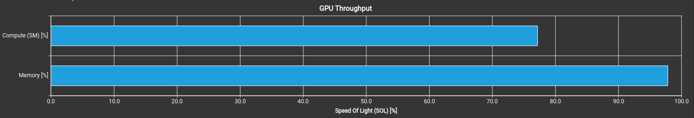
*Tiled fp32: below the compute roofline, bound by L2/DRAM bandwidth*

### Compute-bound — Library fp32 SIMT

cuBLAS Sgemm and CUTLASS fp32 SIMT sit **right of the ridge point**. Deep register blocking, software pipelining, and warp-level scheduling achieve sufficient arithmetic intensity to saturate fp32 FMA throughput. This is the key qualitative gap between library-grade and hand-written kernels on this device.

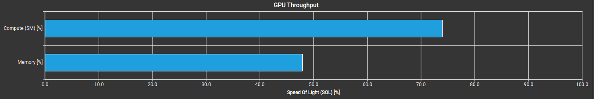
*cuBLAS SIMT fp32: right of the ridge point — compute-bound*

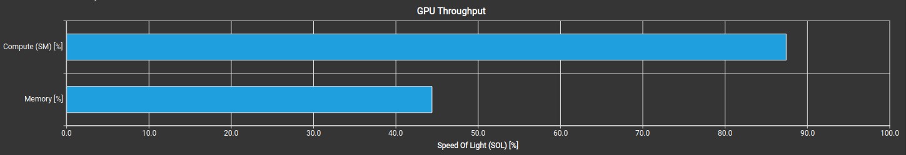
*CUTLASS SIMT fp32: similarly compute-bound — library register scheduling closes the gap*

### Memory-bound again — fp16 Tensor Core

fp16 TC kernels return to the memory-bound regime despite 4–7× higher throughput than fp32. The sm_87 TC roofline (~40 TOPS) is far enough right that even CUTLASS's multistage async pipeline cannot feed the MMA units fast enough at 2048×2048. Higher GFLOPS here reflects faster fp16 arithmetic, not freedom from bandwidth constraints.

### Summary

| Kernel | Bound | One-line reason |
|--------|-------|-----------------|
| Naive, Tiled v1 | Memory | Low arithmetic intensity; DRAM traffic dominates |
| Tiled v2/v3, TC WMMA | Memory | Tiling raises intensity but doesn't reach ridge point |
| cuBLAS Sgemm fp32 | **Compute** | Library register blocking crosses the ridge |
| CUTLASS fp32 SIMT | **Compute** | Structured templates achieve same compute-bound regime |
| cuBLAS GemmEx fp16 TC | Memory | TC roofline too high; bandwidth-limited at 2048×2048 |
| CUTLASS fp16 TC | Memory | Multistage pipeline cannot overcome BW ceiling |

---

## Repository Structure

```
.
├── artifacts/                           # NCU roofline screenshots
│   ├── ncu_matmul_tiled.png             # Hand-written tiled fp32 (memory-bound)
│   ├── ncu_cublass_SIMT_GEMM_fp32.png   # cuBLAS fp32 SIMT (compute-bound)
│   └── ncu_cutlass_SIMT_GEMM_fp32.png   # CUTLASS fp32 SIMT (compute-bound)
├── baseline/                            # Naive + tiled + TC basic kernels
│   ├── main.cu / kernels.cuh / utils.cuh
│   ├── matmul_kernels.cu / memory_kernels.cu / wmma_matmul_kernels.cu
│   └── results/                         # CSV, PNGs, run.log, NCU/Nsys reports
├── Optimized/                           # cp.async, WPT, double-buffered TC kernels
│   └── results/                         # same layout as baseline/results/
├── cublass_and_cutlass/                 # Library ceiling benchmarks
│   ├── cublas_baseline.cu / cutlass_baseline.cu
│   └── results/                         # per-library CSVs, PNGs, NCU/Nsys reports
├── build/                               # Compiled binaries (generated)
├── results/                             # Combined cross-build charts
├── plot_results.py                      # Unified plotting script
├── Makefile / setup.sh
└── report*.ncu-rep / report*.nsys-rep   # Top-level profiler reports
```

---

## Plotting

```bash
python3 plot_results.py              # all four builds
python3 plot_results.py --baseline-only
python3 plot_results.py --optimized-only
python3 plot_results.py --cublas-only
python3 plot_results.py --cutlass-only
```

Charts per build: `memory_bandwidth.png`, `memory_slowdown_heatmap.png`, `matmul_gflops.png`, `matmul_latency.png`, `matmul_speedup.png` (skipped for library-only CSVs).

Combined chart: `results/matmul_gflops_combined.png` — full ladder across all four builds.

### CSV Format

```
benchmark,variant,n_or_size,avg_ms,metric_value,metric_unit
memory,Sequential,1048576,0.139,60.35,GB/s
matmul,naive,2048,100.119,171.59,GFLOPS
matmul,cublas_sgemm,2048,14.954,1148.87,GFLOPS
```

Recognised `variant` names: `naive`, `tiled`, `tiled_v2`, `tiled_v3`, `tc_basic`, `tc_optimized`, `cutlass_fp32`, `cutlass_fp16_tc`, `cublas_sgemm`, `cublas_gemmex_fp16`.
